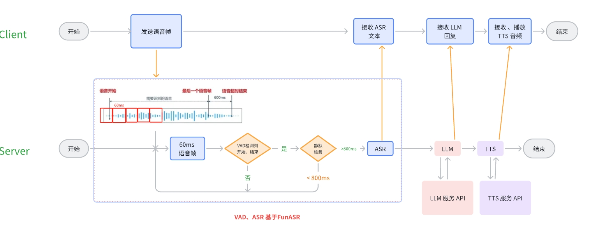

## Overview

Server: 
- VAD，ASR 2个模块使用 [FunASR](https://github.com/modelscope/FunASR) 现有的模型。直接部署在server内部
- LLM是本人微调后的Qwen1.5模型，使用vllm后端部署。使用API接口形式访问
- TTS是本人微调后的Bert-VITS2模型。使用API接口形式访问

理论上，LLM和TTS可以替换成自己微调 或者 第三方的api接口。只需要修改`server.py`中的`llm_and_tts`函数即可。Tip: 替换前，记得先独立测试每个模块。




## Features

### Server
server支持多个客户端同时连接。
服务器接受客户端传输的语音，服务器进行vad检测、800ms静默等待、ASR， 得到用户语音对应的文本。 然后依次调用LLM得到回答，最后使用TTS得到语音，传输到客户端。

### Client
客户端连接到服务器后，麦克风实时传输60ms的语音片段到服务器。


## Dependencies

### Server

```
pip install funasr==1.0.10
pip install websockets
```


### Client

客户端的Python环境建议使用3.10

``` shell
pip install websockets pygame
pip install pyaudio
```
如果无法安装 pyaudio库， 可以下载从[PyPI官网](https://pypi.org/project/PyAudio/#files) 下载whl文件， 目前只支持 Windows, Python 3.8 ~ 3.12版本。

下载好whl 包后，使用 `pip install /path/to/PyAudio-0.2.14-cp-xxx.whl` 安装即可。


## Running

运行Server前，从ModelScope下载对应的模型。[FunASR模型下载参考](https://raw.githubusercontent.com/modelscope/FunASR/main/runtime/docs/SDK_advanced_guide_online_zh.md)

下载链接
- [FSMN-VAD模型](https://www.modelscope.cn/models/iic/speech_fsmn_vad_zh-cn-16k-common-pytorch)
- [Paraformer-lagre非实时模型](https://www.modelscope.cn/models/iic/speech_paraformer-large_asr_nat-zh-cn-16k-common-vocab8404-pytorch)
- [Paraformer-lagre实时模型](https://www.modelscope.cn/models/iic/speech_paraformer-large_asr_nat-zh-cn-16k-common-vocab8404-online)
- [CT-Transformer标点预测模型](https://www.modelscope.cn/models/iic/punc_ct-transformer_zh-cn-common-vocab272727-pytorch)


### Server
下载好4个模型后，运行服务器
```
CUDA_VISIBLE_DEVICES=2 python \
    src/funasr_wss_server.py \
    --port 10122 \
    --asr_model /data1/wqzh/HF-Models/FunASR-Chat/speech_paraformer-large_asr_nat-zh-cn-16k-common-vocab8404-pytorch \
    --asr_model_online /data1/wqzh/HF-Models/FunASR-Chat/speech_paraformer-large_asr_nat-zh-cn-16k-common-vocab8404-online \
    --punc_model /data1/wqzh/HF-Models/FunASR-Chat/punc_ct-transformer_zh-cn-common-vocab272727-pytorch \
    --vad_model /data1/wqzh/HF-Models/FunASR-Chat/speech_fsmn_vad_zh-cn-16k-common-pytorch 
```

### Client
服务器启动后，运行客户端，连接到服务器
```
python src/funasr_wss_client.py  --host 122.225.x.x --port 10122  --mode 2pass --chunk_size "5,10,5" --output_dir ./ --ssl 0
```
`--host`指的是server端的部署IP, 如果server是部署在本地，请使用`127.0.0.1`，也可以是公网IP。


## BUGs
目前还存在几个可以优化的点：
- 目前不支持说话打断 (说话打断涉及到 回声分离、说话人分离等技术)
- 


## Acknowledgements

- https://github.com/modelscope/FunASR/blob/main/runtime/python/websocket/funasr_wss_server.py
- https://github.com/Ikaros-521/RealtimeSTT_LLM_TTS/RealtimeSTT_server.py
- https://github.com/hanifabd/voice-activity-detection-vad-realtime/blob/master/vad-stt-chatbot/vad-stt-chatbot.py